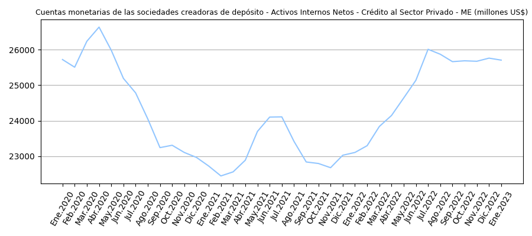
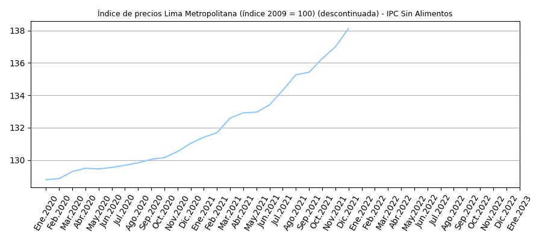

# bcrpy

Un cliente API para la extraccion, consulta y analisis de la base de datos [BCRPData](https://estadisticas.bcrp.gob.pe/estadisticas/series/) del [Banco Central de Reserva del Peru (BCRP)](https://www.bcrp.gob.pe/) escrito para Python. Este cliente es un _wrapper_ de la [API para Desarrolladores](https://estadisticas.bcrp.gob.pe/estadisticas/series/ayuda/api) del BCRP.


# Installation and Local Usage

To import this repository to your local environment and access it (on terminal):

```ruby
virtualenv venv
source venv/bin/activate
pip install bcrpy
```

# Examples
#### [In]
```ruby
import bcrpy

banc = bcrpy.Marco()			# cargar objeto

banc.get_metadata()			# obtener todos los metadatos del BCRPData 
print(banc.metadata)		# imprimir metadatos obtenidos
```

#### [Out]
| | Código de serie      |          Categoría de serie  | ... | Memo Unnamed: 13 |
| -----------           | -----------           | -----------                |-----------  | -----------  |
|0 |          PN00001MM |  Sociedades creadoras de depósito |  ... | NaN |        NaN |
|1 |          PN00002MM |  Sociedades creadoras de depósito |  ... | NaN |        NaN |
|2 |          PN00003MM |  Sociedades creadoras de depósito |  ... | NaN |        NaN |
|3 |          PN00004MM |  Sociedades creadoras de depósito |  ... | NaN |        NaN |
|4 |          PN00005MM |  Sociedades creadoras de depósito |  ... | NaN |        NaN |
| ... |              ... |                             | ... | ... | ... |        ... |
| 14853 |      PD39791AM  |      Expectativas Empresariales | ... | NaN |        NaN |
| 14854  |     PD39792AM  |      Expectativas Empresariales | ... | NaN |        NaN |
| 14855  |     PD39793AM  |      Expectativas Empresariales | ... | NaN |        NaN |
| 14856  |     PD39794AM  |      Expectativas Empresariales | ... | NaN |        NaN |
| 14857  |     PD39795AM  |      Expectativas Empresariales | ... | NaN |        NaN |

#### [In]
```ruby
import bcrpy

banc = bcrpy.Marco()			# cargar objeto

#hacer una consulta del codigo de serie predeterminado de este metodo (actualmente 'PD39793AM') con el API del BCRPData
banc.query()			

#hacer otra consulta, pero para el codigo de serie 'PN00015MM'
banc.query('PN00015MM')		
```

#### [Out] 

running query for PD39793AM...

PD39793AM es indice 14855 en metadatos
```json
{
        "Código de serie": "PD39793AM",
        "Categoría de serie": "Expectativas Empresariales",
        "Grupo de serie": "Expectativas empresariales sectoriales",
        "Nombre de serie": "Índice de expectativas del sector a 12 meses - Servicios",
        "Fuente": NaN,
        "Frecuencia": "Mensual",
        "Fecha de creación": "2023-02-28",
        "Grupo de publicación": "Expectativas macroeconómicas y de ambiente empresarial",
        "Área que publica": "Departamento de Indicadores de la Actividad Economía",
        "Fecha de actualización": "2023-02-28",
        "Fecha de inicio": "Abr-2010",
        "Fecha de fin": "Sep-2022",
        "Memo": NaN
}
```
running query for PN00015MM...

PN00015MM es indice 14 en metadatos
```json
{
        "Código de serie": "PN00015MM",
        "Categoría de serie": "Sociedades creadoras de depósito",
        "Grupo de serie": "Cuentas monetarias de las sociedades creadoras de depósito",
        "Nombre de serie": "Activos Internos Netos - Crédito al Sector Privado - ME (millones US$)",
        "Fuente": "BCRP",
        "Frecuencia": "Mensual",
        "Fecha de creación": "2022-03-24",
        "Grupo de publicación": "Sistema financiero y empresas bancarias y expectativas sobre condiciones crediticias",
        "Área que publica": "Departamento de Estadísticas Monetarias",
        "Fecha de actualización": "2023-02-24",
        "Fecha de inicio": "Abr-1992",
        "Fecha de fin": "Sep-2022",
        "Memo": NaN
}
```

#### [In]
```ruby
import bcrpy
import matplotlib.pyplot as plt 

banc = bcrpy.Marco()	#cargar objeto

#escoger los inputs de los datos que se desean extraer del BCRPData (otros datos como banc.idioma (='ing') son predeterminados, pero tambien se pueden cambiar)
banc.codigos = ['PN01288PM','PN01289PM','PN00015MM']
banc.fechaini = '2020-1'
banc.fechafin = '2023-1'

banc.state_inputs()			# mostrar el estado actual de los inputs escogidos 

df = banc.GET('GET.csv')	# obtener informacion de los inputs escogidos (arriba) con el API del BCRP y guardarlas como un archivo con el nombre 'GET.csv'

#graficos (plots)
for name in df.columns:
    plt.figure(figsize=(9, 4))
    banc.plot(df[name],name,'plot')
    plt.show()
plt.show()
```

#### [Out]


running current inputs state...

        self.metadata = \<vacio>
        self.codigos = ['PN01288PM', 'PN01289PM', 'PN00015MM']
        self.formato = json
        self.fechaini = 2020-1
        self.fechafin = 2023-1
        self.idioma = ing

https://estadisticas.bcrp.gob.pe/estadisticas/series/api/PN01288PM-PN01289PM-PN00015MM/json/2020-1/2023-1/ing





