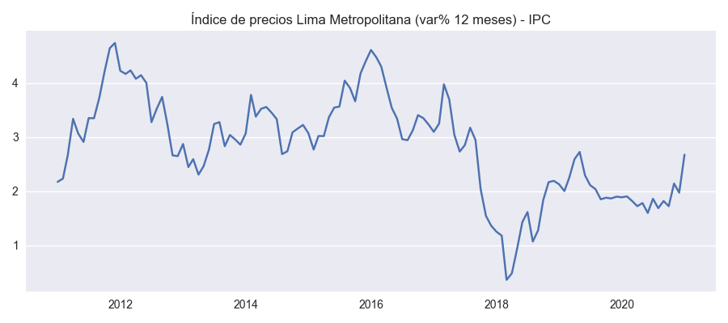
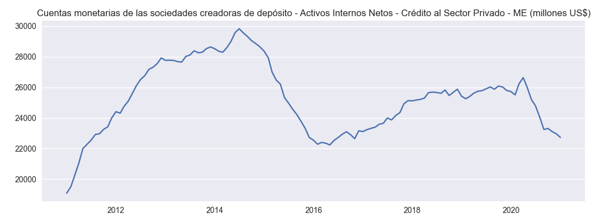

Uso
=====

.. _installation:

Instalación
------------

En su sistema local (laptop o computadora) `bcrpy` puede ser instalada con el comando `pip install bcrpy`. Aun asi, se recomienda instalar `bcrpy` 
dentro de un `ambiente virtual virtualenv <https://docs.python.org/es/3/library/venv.html>`_. El protocolo para aquel seria el siguiente:

.. code-block:: console
   
   $ virtualenv venv
   $ source venv/bin/activate
   (.venv) $ pip install bcrpy

``bcrpy`` ha sido desarrollado con un protocolo de programación orientada a objetos 
(tambien conocido como `*Object Oriented Programming (OOP)* <https://en.wikipedia.org/wiki/Object-oriented_programming>`_) 
lo cual se reduce a que objetos pueden ser usados a almacenar metodos (funciones), datos, y su manejo de aquellos. 

Extracción de metadatos
-------------------------------

En el caso de abajo, vemos como el objeto definido con la variable ``banco`` se usa para extraer los metadatos del BCRPData con el metodo ``get_metadata``,
el cual la almacena como un ``Pandas DataFrame`` dentro de su variable constructora ``metadata``

.. code-block:: python

   import bcrpy

   banco = bcrpy.Marco()			# cargar objeto
   banco.get_metadata()			        # obtener todos los metadatos del BCRPData 

>>> print(type(banco.metadata))		  # imprimir estructura de data de metadatos
<class 'pandas.core.frame.DataFrame'>
>>> print(banco.metadata.shape)      # imprimir numero de filas y columnas 
(14858, 14)

Arriba vemos que los metadatos almacenados en ``banco.metadata`` contienen 14,858 filas con 14 columnas. 

Busqueda de palabras en metadatos 
-------------------------------------------------------------

El siguiente ejemplo muestra el metodo ``wordsearch``, el cual busca las filas de los metadatos en las cuales se encuentren palabras parecidas a la "palabra clave" que esta siendo buscada. 
En el caso de abajo, usamos ``wordsearch`` para buscar la palabra "economia" en las columnas 0 y 1 (primera y segunda) de la base de datos del BCRP. 

>>> banco.wordsearch('economia',columnas =[0,1])
corriendo wordsearch: `economia`
cutoff = 0.65; columnas = [0, 1]
por favor esperar...

.. code-block:: ruby

     0%|                                                                  | 0/2 [00:00<?, ?it/s]
    50%||||||||||||||||||||||||||||||||||                                 | 1/2 [00:00<00:00,  3.17it/s]
   100%|||||||||||||||||||||||||||||||||||||||||||||||||||||||||||||||||||| 2/2 [00:00<00:00,  2.07it/s]

         Código de serie      Categoría de serie  ... Memo Unnamed: 13
   1137        PN01205PM  Tipo de cambio nominal  ...  NaN         NaN
   1138        PN01206PM  Tipo de cambio nominal  ...  NaN         NaN
   1139        PN01207PM  Tipo de cambio nominal  ...  NaN         NaN
   1140        PN01208PM  Tipo de cambio nominal  ...  NaN         NaN
   1141        PN01209PM  Tipo de cambio nominal  ...  NaN         NaN
   ...               ...                     ...  ...  ...         ...
   13886       PN38685FM     Resultado económico  ...  NaN         NaN
   13887       PN38686FM     Resultado económico  ...  NaN         NaN
   13888       PN38687FM     Resultado económico  ...  NaN         NaN
   13889       PN38688FM     Resultado económico  ...  NaN         NaN
   14586       PN39524FM     Resultado económico  ...  NaN         NaN

   [476 rows x 14 columns]

Podemos ver en la primera linea del output que la precision a encontrar la palabra exacta esta predeterminada en 0.65 (65%). 

Si quisieramos buscar una palabra en la base de datos que sea 100% igual (capitalizacion incluida), podemos aumentar el input 
``cutoff`` a un valor de 1. 

Consultas de codigos de serie
------------------------------------------------------

Tambien podemos hacer consultas individuales de un codigo de serie con el metodo ``query``, para que nos den la informacion mas organizada en una estructura de mapa (json). 
Abajo, hacemos dos consultas con dos codigos de serie de la database: 

.. code-block:: python

   #hacer una consulta del codigo de serie  'CD12209DA' con el API del BCRPData
   banco.query('CD12209DA')			

   #hacer otra consulta, pero para el codigo de serie 'CD11608DA'
   banco.query('CD11608DA')	

.. code-block:: ruby

   [Out]

   corriendo query para CD12209DA...

   CD12209DA es indice 9030 en metadatos
   {
         "Código de serie": "CD12209DA",
         "Categoría de serie": "Primera centuria independiente",
         "Grupo de serie": "Marina mercante nacional, 1918-1931",
         "Nombre de serie": "Tonelaje de Registro ",
         "Fuente": "Compendio de Historia Económica del Perú - Tomo IV",
         "Frecuencia": "Anual",
         "Fecha de creación": "2018-05-24",
         "Grupo de publicación": NaN,
         "Área que publica": "Departamento de Bases de Datos Macroeconómicas",
         "Fecha de actualización": "2018-05-24",
         "Fecha de inicio": "1918",
         "Fecha de fin": "1924",
         "Memo": NaN
   }
   corriendo query para CD11608DA...

   CD11608DA es indice 8440 en metadatos
   {
         "Código de serie": "CD11608DA",
         "Categoría de serie": "Primera centuria independiente",
         "Grupo de serie": "Población por departamentos y provincias para 1791, 1836, 1850, 1862 y 1876 (número)",
         "Nombre de serie": "Lima - Amazonas - Totales Departamentales",
         "Fuente": "Compendio de Historia Económica del Perú - Tomo IV",
         "Frecuencia": "Anual",
         "Fecha de creación": "2018-05-24",
         "Grupo de publicación": NaN,
         "Área que publica": "Departamento de Bases de Datos Macroeconómicas",
         "Fecha de actualización": "2018-05-24",
         "Fecha de inicio": "1791",
         "Fecha de fin": "1876",
         "Memo": NaN
   }

Opciones de Almacenamiento para Extracción de Datos
--------------------------------------------------------------------------------------

Al extraer series temporales, el método ``GET()`` de ``bcrpy`` permite especificar el formato de almacenamiento de los datos, con dos opciones disponibles:

- **DataFrame (`df`)**: Esta es la opción predeterminada, donde los datos se almacenan y devuelven en forma de un `Pandas DataFrame`.
- **SQLite (`sql`)**: Los datos se almacenan en una base de datos SQLite, ideal para optimizar el rendimiento en consultas de gran volumen o para almacenamiento persistente.

Para seleccionar el formato de almacenamiento, usa el parámetro `storage` en el método `GET()` de la siguiente manera:

.. code-block:: python

   # Extracción en formato DataFrame (predeterminado)
   df = banco.GET(storage='df')

   # Extracción y almacenamiento en una base de datos SQLite
   df_sql = banco.GET(storage='sql')

Ejemplo de Uso con Opciones de Almacenamiento
-------------------------------------------------------

En este ejemplo, extraemos datos de series temporales y almacenamos los resultados en ambos formatos:

.. code-block:: python

   import bcrpy

   # Crear objeto y configurar parámetros de consulta
   banco = bcrpy.Marco()
   banco.codes = ['PN01273PM', 'PN00015MM']
   banco.fechaini = '2020-1'
   banco.fechafin = '2021-1'

   # Extracción en formato DataFrame
   df = banco.GET(storage='df')
   print("Data almacenada en DataFrame:")
   print(df)

   # Extracción y almacenamiento en SQLite
   df_sql = banco.GET(storage='sql')
   print("Data almacenada en SQLite:")
   print(df_sql)

Ejemplo : Extraer todos los metadatos de series economicas con frecuencias mensuales
-------------------------------------------------------------------------------------------------------------------

De los metadatos anteriores, se puede observar que la frecuencia de las series económicas está definida en la sexta columna.
En este caso, la frecuencia es anual para ambos metadatos. Sin embargo, si se desea buscar metadatos que tengan una frecuencia 
mensual, es posible utilizar la función ``wordsearch`` para buscar registros que contengan la palabra "Mensual" en la sexta columna, con un ``cutoff=1`` 
(lo que indica una precisión de palabra restringida al 100%) en la columna con índice 5. 
Cabe destacar que, en Python, los índices de las columnas comienzan a contarse desde 0 en lugar de 1:

>>> df_mensuales = banco.wordsearch("Mensual",cutoff=1,columnas=[5])
corriendo wordsearch: `Mensual`
cutoff = 1; columnas = [5]
por favor esperar...

.. code-block:: ruby

   0%|                                                           | 0/1 [00:00<?, ?it/s]
   100%||||||||||||||||||||||||||||||||||||||||||||||||||||||||||| 1/1 [00:00<00:00,  3.11it/s]

      Código de serie                Categoría de serie                                     Grupo de serie  ... Fecha de fin Memo Unnamed: 13
   0           PN00001MM  Sociedades creadoras de depósito  Cuentas monetarias de las sociedades creadoras...  ...     Sep-2022  NaN         NaN
   1           PN00002MM  Sociedades creadoras de depósito  Cuentas monetarias de las sociedades creadoras...  ...     Sep-2022  NaN         NaN
   2           PN00003MM  Sociedades creadoras de depósito  Cuentas monetarias de las sociedades creadoras...  ...     Sep-2022  NaN         NaN
   3           PN00004MM  Sociedades creadoras de depósito  Cuentas monetarias de las sociedades creadoras...  ...     Sep-2022  NaN         NaN
   4           PN00005MM  Sociedades creadoras de depósito  Cuentas monetarias de las sociedades creadoras...  ...     Sep-2022  NaN         NaN
   ...               ...                               ...                                                ...  ...          ...  ...         ...
   14853       PD39791AM        Expectativas Empresariales             Expectativas empresariales sectoriales  ...     Sep-2022  NaN         NaN
   14854       PD39792AM        Expectativas Empresariales             Expectativas empresariales sectoriales  ...     Sep-2022  NaN         NaN
   14855       PD39793AM        Expectativas Empresariales             Expectativas empresariales sectoriales  ...     Sep-2022  NaN         NaN
   14856       PD39794AM        Expectativas Empresariales             Expectativas empresariales sectoriales  ...     Sep-2022  NaN         NaN
   14857       PD39795AM        Expectativas Empresariales             Expectativas empresariales sectoriales  ...     Sep-2022  NaN         NaN

   [6641 rows x 14 columns]

El código anterior almacena los metadatos de todas las series económicas con frecuencia mensual encontradas mediante la función 
``wordsearch`` en una ``pandas.DataFrame`` con el nombre "df_mensuales". Se observa que los metadatos filtrados corresponden a 6641 códigos de los más de 14,000 presentes en BCRPData.

Facil extracción de series economicas y generacion de graficas 
-------------------------------------------------------------------

El ingenio del *Object Oriented Programming (OOP)* se encuentra en que los inputs del objeto (en este caso, el objeto definido como ``banco``) pueden ser modificados y sus metodos (funciones) pueden funcionar con aquellos cambios. 

Abajo se definen los codigos de serie y el rango de fechas para despues imprimirlos con el metodo ``parameters()`` y extraear los datos con aquellas especificaciones del BCRPData con el metodo ``GET()``, el cual regresa aquellos datos como un ``Pandas DataFrame``. 

Como podemos ver abajo, estos datos son almacenados en la variable ``df``, la cual se usa para hacer graficos con el metodo ``plot()`` del objeto definido como ``banco``. 

.. code-block:: python

   import matplotlib.pyplot as plt
   plt.style.use("seaborn")

   #escoger los inputs de los datos que se desean extraer del BCRPData (otros datos como banco.idioma (='ing') son predeterminados, pero tambien se pueden cambiar)
   banco.codes = ['PN01273PM','PN00015MM','PN01289PM','PD39793AM']
   banco.fechaini = '2011-1'
   banco.fechafin = '2021-1'

   banco.parameters()			# mostrar el estado actual de los inputs escogidos 

   # obtener informacion de los inputs seleccionados (arriba) en el mismo orden  
   df = banco.GET()	

   #plantilla para hacer plots
   def plot_template(data,title):
      plt.title(title, fontsize=12)
      plt.grid(axis="x")
      plt.plot(data)
      plt.tight_layout()
        
   for name in df.columns:
      plt.figure(figsize=(9, 4))
      plot_template(df[name],name)
   plt.show()

``corriendo estado actual de todas las variables constructoras...``

..
   .. table:: 
      :widths: 10 3 40

      ================ === ===========================================
      objeto.metadata   =     <class 'pandas.core.frame.DataFrame'> size: (14858, 14)
      objeto.codes    =     ['PN01273PM', 'PN00015MM', 'PN01289PM', 'PD39793AM']
      objeto.formato    =     json
      objeto.fechaini   =     2011-1
      objeto.fechafin   =     2021-1
      objeto.idioma     =     ing
      ================ === ===========================================
      
**Object Attributes:**

- **objeto.metadata**: `<class 'pandas.core.frame.DataFrame'>` size: (14858, 14)
- **objeto.codes**: ['PN01273PM', 'PN00015MM', 'PN01289PM', 'PD39793AM']
- **objeto.formato**: json
- **objeto.fechaini**: 2011-1
- **objeto.fechafin**: 2021-1
- **objeto.idioma**: ing

``Orden de datos determinados por usuario:``

.. table:: 
   :widths: 10 20 50 

   ====== ===================== ================================
    1       PN01273PM            Índice de precios Lima Metropolitana (var% 12 meses) - IPC                                                                              
    2       PN00015MM            Cuentas monetarias de las sociedades creadoras de depósito - Activos Internos Netos - Crédito al Sector Privado - ME (millones US$)     
    3       PN01289PM            Índice de precios Lima Metropolitana (índice 2009 = 100) (descontinuada) - IPC Sin Alimentos y Energía                                  
    4       PD39793AM            Expectativas empresariales sectoriales - Índice de expectativas del sector a 12 meses - Servicios                                       
   ====== ===================== ================================

https://estadisticas.bcrp.gob.pe/estadisticas/series/api/PN01273PM-PN00015MM-PN01289PM-PD39793AM/json/2011-1/2021-1/ing

.. image:: ../img/Figure_4.png
  :width: 600
  :alt: figure 4

El orden de las columnas en la tabla de datos ``pandas.DataFrame`` ``"df"`` ahora se colocan en el mismo orden en el cual han sido colocados  por el usuario en la variable ``banco.codes``
como opcion predeterminada. Si se desea usar el orden definido por BCRPData, reemplazar ``banco.GET()`` por ``banco.GET(order=False)``. 

La identidad de los nombres de serie con sus codigos, y en si cualquier lista con `x` codigos de series, se puede consultar con una iteracion del metodo ``query``, demostrado abajo:

>>> [banco.query(codigo) for codigo in banco.codes]   #referencia, codigos

.. code-block:: ruby

   [Out]

   corriendo query para PN01273PM...

   PN01273PM es indice 1198 en metadatos
   {
         "Código de serie": "PN01273PM",
         "Categoría de serie": "Inflación",
         "Grupo de serie": "Índice de precios Lima Metropolitana (var% 12 meses)",
         "Nombre de serie": "IPC",
         "Fuente": "INEI",
         "Frecuencia": "Mensual",
         "Fecha de creación": "2022-04-08",
         "Grupo de publicación": "Índice de precios al consumidor y tipo de cambio real",
         "Área que publica": "Departamento de Estadísticas de Precios",
         "Fecha de actualización": "2023-03-09",
         "Fecha de inicio": "Abr-1950",
         "Fecha de fin": "Sep-2022",
         "Memo": NaN
   }
   corriendo query para PN00015MM...

   PN00015MM es indice 14 en metadatos
   {
         "Código de serie": "PN00015MM",
         "Categoría de serie": "Sociedades creadoras de depósito",
         "Grupo de serie": "Cuentas monetarias de las sociedades creadoras de depósito",
         "Nombre de serie": "Activos Internos Netos - Crédito al Sector Privado - ME (millones US$)",
         "Fuente": "BCRP",
         "Frecuencia": "Mensual",
         "Fecha de creación": "2022-03-24",
         "Grupo de publicación": "Sistema financiero y empresas bancarias y expectativas sobre condiciones crediticias",
         "Área que publica": "Departamento de Estadísticas Monetarias",
         "Fecha de actualización": "2023-02-24",
         "Fecha de inicio": "Abr-1992",
         "Fecha de fin": "Sep-2022",
         "Memo": NaN
   }
   corriendo query para PN01289PM...

   PN01289PM es indice 1212 en metadatos
   {
         "Código de serie": "PN01289PM",
         "Categoría de serie": "Inflación",
         "Grupo de serie": "Índice de precios Lima Metropolitana (índice 2009 = 100) (descontinuada)",
         "Nombre de serie": "IPC Sin Alimentos y Energía",
         "Fuente": "INEI",
         "Frecuencia": "Mensual",
         "Fecha de creación": "2022-04-07",
         "Grupo de publicación": "Índice de precios al consumidor y tipo de cambio real",
         "Área que publica": "Departamento de Estadísticas de Precios",
         "Fecha de actualización": "2022-04-07",
         "Fecha de inicio": "Abr-1991",
         "Fecha de fin": "Sep-2021",
         "Memo": NaN
   }
   corriendo query para PD39793AM...

   PD39793AM es indice 14855 en metadatos
   {
         "Código de serie": "PD39793AM",
         "Categoría de serie": "Expectativas Empresariales",
         "Grupo de serie": "Expectativas empresariales sectoriales",
         "Nombre de serie": "Índice de expectativas del sector a 12 meses - Servicios",
         "Fuente": NaN,
         "Frecuencia": "Mensual",
         "Fecha de creación": "2023-02-28",
         "Grupo de publicación": "Expectativas macroeconómicas y de ambiente empresarial",
         "Área que publica": "Departamento de Indicadores de la Actividad Economía",
         "Fecha de actualización": "2023-03-09",
         "Fecha de inicio": "Abr-2010",
         "Fecha de fin": "Sep-2022",
         "Memo": NaN
   }

Extraccion mas de 100 Series temporales con LargeGET
-----------------------------------------------------------

Con **largeGET**, las posibilidades son ilimitadas cuando se trata de solicitudes GET, 
ya que puede manejar tantos códigos de series temporales como se necesiten. Este método divide los códigos de series temporales en fragmentos 
de 100 series o menos, luego realiza solicitudes GET de forma iterativa y re-ensambla los fragmentos de datos en un full dataframe. Hemos 
encontrado la forma de hacer este proceso mas rapido con *parallel computing (multiprocessing)*, utilizando multiples procesadores concurrentemente  

Para correr **largeGET** con concurrencia (computacion paralela en nucleos CPU), activar ``turbo`` y especificar el numero de nucleos de la siguiente manera:

.. code-block:: python

   import bcrpy

   banco = bcrpy.Marco()			# cargar objeto
   banco.fechaini = '2002'
   banco.fechafin = '2022'

   # extraer metadatos para Series anuales (columna 5 == Frecuencia)
   df_mensuales = banco.wordsearch("Anual",cutoff=1,columnas=[5])

   codes = [i for i in df_mensuales.iloc[:,0]]
   df = banco.largeGET(codes,turbo=True, nucleos=4)

La mayoria de computadoras modernas tienen de 2 a 4 nucleos CPU. Si no esta seguro cuantos nucleos y 4 no funciona, trate con nucleos=2. 
Si no deseas utilizar la paralelización, simplemente cambia la opción turbo a False. 

Este codigo devuelve un DataFrame (df) que contiene todas las Series anuales de BCRPData desde el 2002 hasta el 2022, 
lo que resulta en un total de 5,564 columnas!